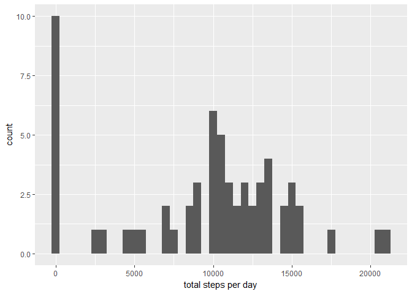
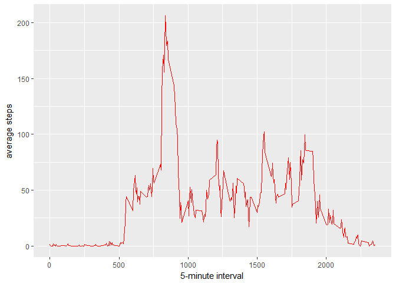
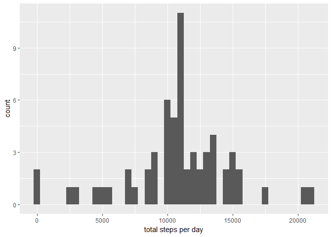
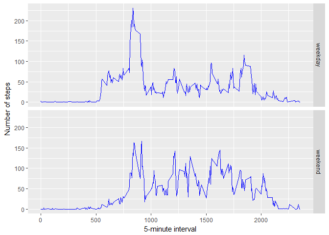

## Loading and preprocessing the data
Unzip & read the data

```r
unzip(zipfile = "activity.zip")
activity <- read.csv("activity.csv")
```
Take a look at the structure and the first 10 rows of the data

```r
str(activity)
```

```
## 'data.frame':	17568 obs. of  3 variables:
##  $ steps   : int  NA NA NA NA NA NA NA NA NA NA ...
##  $ date    : Factor w/ 61 levels "2012-10-01","2012-10-02",..: 1 1 1 1 1 1 1 1 1 1 ...
##  $ interval: int  0 5 10 15 20 25 30 35 40 45 ...
```

```r
head(activity,10)
```

```
##    steps       date interval
## 1     NA 2012-10-01        0
## 2     NA 2012-10-01        5
## 3     NA 2012-10-01       10
## 4     NA 2012-10-01       15
## 5     NA 2012-10-01       20
## 6     NA 2012-10-01       25
## 7     NA 2012-10-01       30
## 8     NA 2012-10-01       35
## 9     NA 2012-10-01       40
## 10    NA 2012-10-01       45
```


## What is mean total number of steps taken per day?
Ignoring the missing values in the dataset:

1. Calculate the total number of steps taken per day
2. Make a histogram of the total number of steps taken each day
3. Calculate and report the mean and median of the total number of steps taken per day

```r
totalstepsperday1 <- tapply(activity$steps, activity$date, FUN = sum, na.rm = TRUE)
library(ggplot2)
qplot(totalstepsperday1, binwidth = 500, xlab = "total steps per day")
```

<!-- -->

```r
mean(totalstepsperday1, na.rm = TRUE)
```

```
## [1] 9354.23
```

```r
median(totalstepsperday1, na.rm = TRUE)
```

```
## [1] 10395
```

## What is the average daily activity pattern?
Make a time series plot (i.e. type = "l") of the 5-minute interval (x-axis) and the average number of steps taken, averaged across all days (y-axis)

```r
averagesteps <- aggregate(x = list(steps = activity$steps), by = list(interval = activity$interval), FUN = mean, na.rm = TRUE)
library(ggplot2)
ggplot(data = averagesteps, aes(x = interval, y = steps)) + geom_line(colour = "red") + xlab("5-minute interval") + ylab("average steps")
```

<!-- -->

Which 5-minute interval, on average across all the days in the dataset, contains the maximum number of steps?

```r
averagesteps[which.max(averagesteps$steps), ]$interval
```

```
## [1] 835
```


## Imputing missing values
Calculate and report the total number of missing values in the dataset (i.e. the total number of rows with NAs)

```r
sum(is.na(activity$steps))
```

```
## [1] 2304
```
Devise a strategy for filling in all of the missing values in the dataset
- missing values will be filled with mean value for that 5-minute interval

Create a new dataset that is equal to the original dataset but with the missing data filled in

```r
fillinvalue <- function(steps, interval) {
# function to fill in missing values with the mean value for the interval
    filledin <- NA
    if (!is.na(steps))
        filledin <- c(steps)
    else
        filledin <- (averagesteps[averagesteps$interval == interval, "steps"])
    return(filledin)
}

# create a new dataset by copying the original
activity.filledin <- activity

# use the function above to fill in missing values in the new dataset
activity.filledin$steps <- mapply(fillinvalue, activity.filledin$steps, activity.filledin$interval)
```

Make a histogram of the total number of steps taken each day and Calculate and report the mean and median total number of steps taken per day

```r
totalstepsperday2 <- tapply(activity.filledin$steps, activity.filledin$date, FUN = sum, na.rm = TRUE)
library(ggplot2)
qplot(totalstepsperday2, binwidth = 500, xlab = "total steps per day")
```

<!-- -->

```r
mean(totalstepsperday2, na.rm = TRUE)
```

```
## [1] 10766.19
```

```r
median(totalstepsperday2, na.rm = TRUE)
```

```
## [1] 10766.19
```

Do these values differ from the estimates from the first part of the assignment? What is the impact of imputing missing data on the estimates of the total daily number of steps? 

- Mean and median values are higher after replacing missing data. 

- In the original data, for days with NA steps for any interval, the total number of steps taken that day is set to 0. Replacing NA steps with the mean steps of associated interval, replaces 0 values with non 0 values, resulting in higher values.

## Are there differences in activity patterns between weekdays and weekends?

Add a new factor to the dataset to differentiate between weekdays and weekends

```r
activity.filledin$day <- ifelse(as.POSIXlt(as.Date(activity.filledin$date))$wday%%6 == 0, "weekend", "weekday")
activity.filledin$day <- factor(activity.filledin$day, levels = c("weekday", "weekend"))
```

Make a panel plot containing a time series plot (i.e. type = "l") of the 5-minute interval (x-axis) and the average number of steps taken, averaged across all weekday days or weekend days (y-axis).


```r
averagesteps2 <- aggregate(steps~interval+day, activity.filledin, mean)
library(ggplot2)
ggplot(averagesteps2, aes(interval, steps)) + geom_line(colour = "blue") + facet_grid(day ~ .) + xlab("5-minute interval") + ylab("Number of steps")
```

<!-- -->
